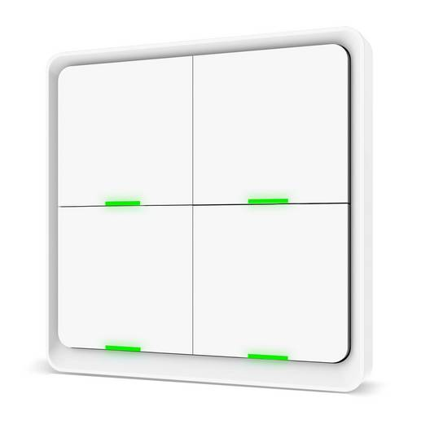
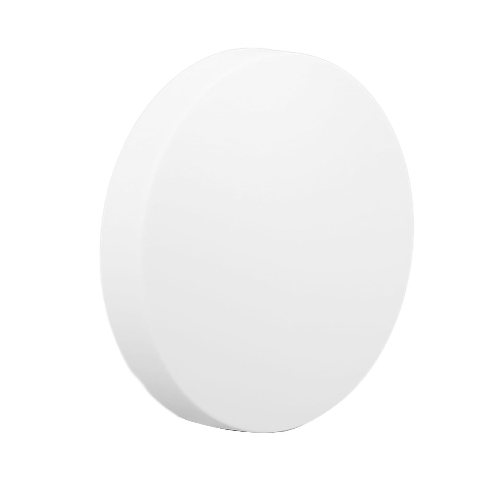
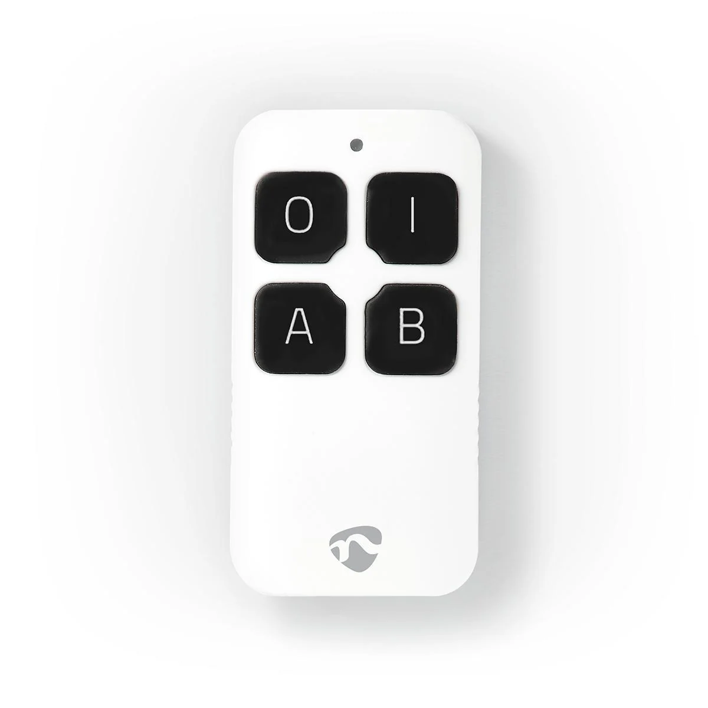
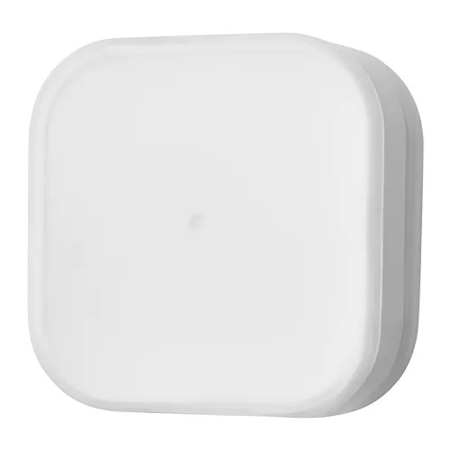
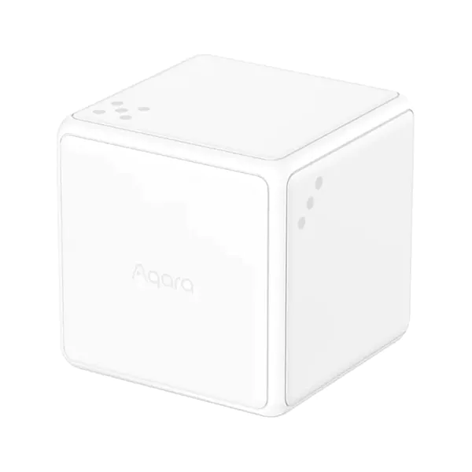

# Some blueprints for ha

## Z2M blueprints based on events:

Remember that you need to enable experimental\_event\_entities.

```
homeassistant:
  experimental_event_entities: true
```

### For Tuya Button (supports 1 to 4 buttons):

<p align="center">
  
&nbsp; &nbsp; &nbsp; &nbsp;
  
</p>

[](https://my.home-assistant.io/redirect/blueprint_import/?blueprint_url=https%3A%2F%2Fgithub.com%2Ffapgomes%2Fha-blueprints%2Fblob%2Fmain%2Fzigbee2mqtt-tuya_1_to_4_buttons.yaml)

### For Nedis Remote:

<p align="center">
  
</p>

[](https://my.home-assistant.io/redirect/blueprint_import/?blueprint_url=https%3A%2F%2Fgithub.com%2Ffapgomes%2Fha-blueprints%2Fblob%2Fmain%2Fzigbee2mqtt-nedis-remote.yaml)

### For IKEA TRADFRI:

<p align="center">
  
</p>

[](https://my.home-assistant.io/redirect/blueprint_import/?blueprint_url=https%3A%2F%2Fgithub.com%2Ffapgomes%2Fha-blueprints%2Fblob%2Fmain%2Fzigbee2mqtt-ikea_tradfri.yaml)

### For Aqara Cube:

<p align="center">
  
</p>

[](https://my.home-assistant.io/redirect/blueprint_import/?blueprint_url=https%3A%2F%2Fgithub.com%2Ffapgomes%2Fha-blueprints%2Fblob%2Fmain%2Fzigbee2mqtt-aqara-cube.yaml)
